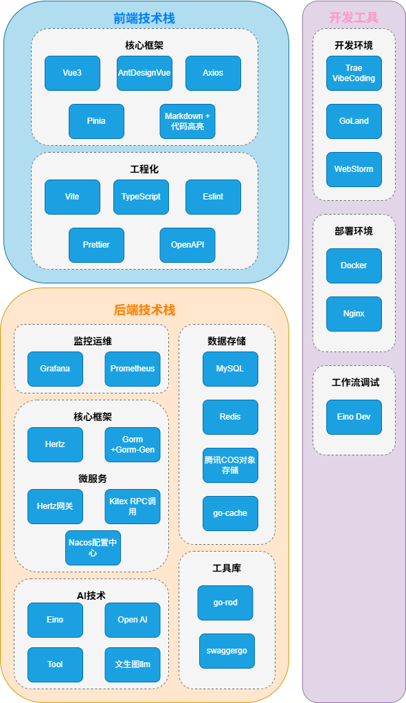

# 易扣AI - 智能代码生成平台

<div align="center">

[](https://golang.org)
[](https://www.docker.com)


</div>

---

## 🚀 项目介绍

**易扣AI** 是一个基于 Eino AI 框架构建的智能代码生成平台，集成了多种 AI 能力和工作流编排功能。用户可以通过自然语言描述需求，系统会自动理解并生成相应的代码、配置文件和项目结构。

---

## ✨ 功能特性

### 🤖 AI 代码生成

- **自然语言编程**：通过对话方式描述需求，AI 自动生成代码
- **代码优化**：自动优化代码结构和性能

### 🔄 工作流编排

- **节点组合**：灵活组合图片收集、代码生成、质量检查等节点
- **状态管理**：支持复杂的状态流转和条件分支
- **实时调试**：集成 Eino DevTools，实时调试工作流

### 📦 应用管理

- **应用创建**：快速创建新应用项目
- **应用部署**：一键部署应用到云端
- **在线预览**：实时预览生成的应用效果

### 💬 对话历史

- **历史记录**：完整保存用户与 AI 的对话历史
- **上下文记忆**：AI 记住对话上下文，提供连贯的交互体验
- **会话管理**：支持多会话管理，隔离不同项目

### 🖼️ 图片处理

- **图片收集**：自动从网络收集相关图片素材
- **图片搜索**：集成 Pexels API，搜索高质量图片
- **图片生成**：使用 AI 生成图片素材
- **图片存储**：集成腾讯云 COS，高效存储图片资源

### 🔒 安全特性

- **限流保护**：防止 API 滥用，保护系统稳定性
- **内容审核**：自动审核生成内容，过滤敏感信息
- **权限控制**：基于用户的权限管理体系
- **数据加密**：敏感数据加密存储和传输

---

## 🏗️ 技术架构

### 后端技术栈

| 技术 | 版本 | 说明 |
|------|------|------|
| [Go](https://golang.org/) | 1.24.9 | 核心开发语言 |
| [Hertz](https://github.com/cloudwego/hertz) | 0.10.3 | HTTP 框架 |
| [Eino](https://github.com/cloudwego/eino) | 0.8.2 | AI 工作流框架 |
| [Wire](https://github.com/google/wire) | 0.7.0 | 依赖注入 |
| [GORM](https://gorm.io/) | 1.31.1 | ORM 框架 |
| [Redis](https://redis.io/) | 7.0 | 缓存和会话存储 |
| [MySQL](https://www.mysql.com/) | 8.0 | 关系型数据库 |
| [Viper](https://github.com/spf13/viper) | 1.19.0 | 配置管理 |

### 前端技术栈

| 技术 | 版本 | 说明 |
|------|------|------|
| [Vue 3](https://vuejs.org/) | Latest | 前端框架 |
| [Ant Design Vue](https://antdv.com/) | Latest | UI 组件库 |
| [Vite](https://vitejs.dev/) | Latest | 构建工具 |
| [TypeScript](https://www.typescriptlang.org/) | Latest | 类型支持 |

### AI 能力

| 服务 | 说明     |
|------|--------|
| [DeepSeek V3.2](https://www.deepseek.com/) | 基本对话模型 |
| [阿里云 DashScope](https://dashscope.aliyun.com/) | 图片生成服务 |
| [Pexels API](https://www.pexels.com/api/) | 图片搜索服务 |

### 架构图



---

## 🚀 快速开始

### 前置要求

- Go 1.24.9+
- Node.js 16+
- MySQL 8.0+
- Redis 7.0+
- Docker & Docker Compose（可选）

### 本地开发

#### 1. 克隆项目

```bash
git clone https://github.com/your-username/yikou-ai-go.git
cd yikou-ai-go
```

#### 2. 配置数据库

```bash
# 创建数据库
mysql -u root -p
CREATE DATABASE yikou_ai CHARACTER SET utf8mb4 COLLATE utf8mb4_unicode_ci;

# 导入表结构
mysql -u root -p yikou_ai < sql/create_table.sql
```

#### 3. 配置文件

编辑 `config/config-local.yml`，填写必要的配置：

```yaml
database:
  host: localhost
  port: 3306
  username: root
  password: your_password
  dbname: yikou_ai

redis:
  host: localhost
  port: 6379
  password: ""
  db: 0

ai:
  chat-model:
    api-key: your_deepseek_api_key
    
dashscope:
  api-key: your_dashscope_api_key
```

#### 4. 安装依赖

```bash
# 后端依赖
go mod download

# 前端依赖
cd yikou-ai-feiwu-front
npm install
```

#### 5. 启动服务

```bash
# 启动后端服务
go run main.go

# 启动前端服务（新终端）
cd yikou-ai-feiwu-front
npm run dev
```

访问 http://localhost:5173 即可操作。

---

## 🐳 Docker 部署 （后端）

```bash
# 构建镜像
docker build -t yikou-ai-go:latest .

# 运行容器
docker run -d \
  --name yikou-ai-go \
  -p 8123:8123 \
  yikou-ai-go:latest
```

---

## 📁 项目结构

```
yikou-ai-go/
├── biz/                    # 业务逻辑层
│   ├── ai/                # AI 相关功能
│   │   ├── agent/         # AI Agent 实现
│   │   ├── aimodel/       # AI 模型定义
│   │   ├── aitools/       # AI 工具集成
│   │   └── llm/           # LLM 模型封装
│   ├── core/              # 核心业务逻辑
│   │   ├── messagehandler/ # 消息处理器
│   │   ├── parser/        # 代码解析器
│   │   └── saver/         # 文件保存器
│   ├── dal/               # 数据访问层
│   ├── graph/             # 工作流图定义
│   │   ├── node/          # 工作流节点
│   │   └── state/         # 工作流状态
│   ├── handler/           # HTTP 处理器
│   ├── manager/           # 第三方客户端管理器
│   ├── middleware/        # 中间件
│   ├── model/             # 数据模型
│   ├── router/            # 路由定义
│   ├── logic/             # 业务服务具体实现
|   └── service/           # 业务接口定义
├── config/                # 配置文件
│   ├── config.go          # 配置加载逻辑
│   ├── config.yml         # 基础配置
│   └── config-prod.yml    # 生产环境配置
├── docs/                  # Swagger 文档
├── pkg/                   # 公共工具包
│   ├── constants/         # 常量定义
│   ├── errors/            # 错误处理
│   ├── myfile/            # 文件操作
│   ├── myutils/           # 工具函数
│   ├── random/            # 随机数生成
│   └── snowflake/         # 雪花算法
├── sql/                   # SQL 脚本
├── wire/                  # 依赖注入
├── yikou-ai-feiwu-front/  # 前端项目
├── Dockerfile             # Docker 构建文件
├── docker-compose.yml     # Docker Compose 配置
├── go.mod                 # Go 模块定义
├── go.sum                 # Go 依赖锁定
└── main.go                # 应用入口
```

---

## 🔧 配置说明

### 多环境配置

项目支持多环境配置，通过 `-env` 参数切换：

```bash
# 使用本地配置
go run main.go -env=local

# 使用生产配置
go run main.go -env=prod
```

### 核心配置项

```yaml
server:
  port: 8123              # 服务端口
  context-path: /api      # API 上下文路径

database:
  host: localhost         # 数据库地址
  port: 3306             # 数据库端口
  username: root         # 数据库用户名
  password: password     # 数据库密码
  dbname: yikou_ai       # 数据库名称

redis:
  host: localhost        # Redis 地址
  port: 6379            # Redis 端口
  password: ""          # Redis 密码
  db: 0                 # Redis 数据库

ai:
  chat-model:
    base-url: https://dashscope.aliyuncs.com/compatible-mode/v1
    api-key: your_api_key
    model-name: deepseek-v3.2
    memory-store: redis
    memory-ttl: 3600

cos:
  host: your_cos_host
  secret-id: your_secret_id
  secret-key: your_secret_key
  region: your_region
  bucket: your_bucket
```

---

## 📚 API 文档

启动服务后，访问以下地址查看 API 文档：

- Swagger UI: http://localhost:8123/swagger/index.html

### 主要 API 端点

| 方法 | 路径 | 说明 |
|------|------|------|
| POST | /api/app/add | 创建应用 |
| POST | /api/app/update | 更新应用 |
| POST | /api/app/delete | 删除应用 |
| GET | /api/app/get | 获取应用详情 |
| POST | /api/app/list | 获取应用列表 |
| POST | /api/app/deploy | 部署应用 |
| GET | /api/app/chat/gen/code | AI 对话生成代码 |
| POST | /api/workflow/execute | 执行工作流 |
| GET | /api/chatHistory/app/:appId | 获取聊天历史 |

---

## 🙏 致谢

感谢以下开源项目和组织：

- [CloudWeGo](https://www.cloudwego.io/) - 提供强大的 Hertz 和 Eino 框架
- [Ant Design](https://ant.design/) - 提供精美的 UI 组件库
- [Vue.js](https://vuejs.org/) - 提供优秀的前端框架

---

## 📞 联系方式

- 个人Github主页: https://github.com/FeiWuSama/yikou-ai-go
- 邮箱: 1825578184@qq.com

---

<div align="center">

**⭐ 如果这个项目对您有帮助，请给我们一个 Star！⭐**

Made with ❤️ by FeiWuSama

</div>
